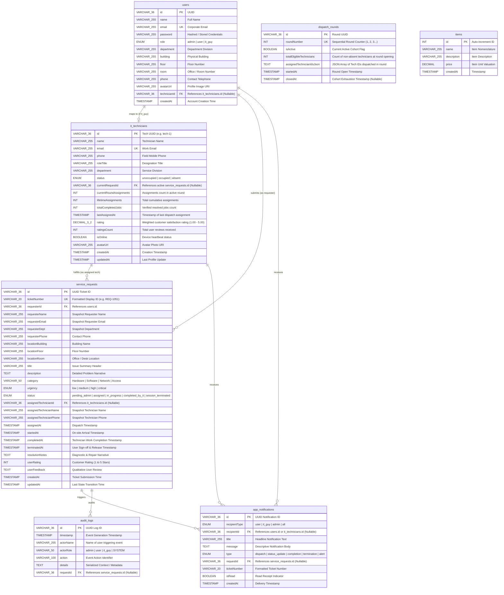

# IT SERVICE DISPATCH & FAIR ODDS MANAGEMENT SYSTEM
## SYSTEM ARCHITECTURE, ENTITY RELATIONSHIP DIAGRAM (ERD) & COMPLETE FILE DIRECTORY
**Document Code:** EFD-2026-V1  
**Project:** IT Service Dispatch System (`react-nest`)  
**Stack:** React 19 (TypeScript) + NestJS v12 (TypeScript) + MySQL (XAMPP / TypeORM)  
**Classification:** Enterprise Engineering Architecture & File Specification  
**Date:** September 2026  

---

## 1. Executive Overview

The **IT Service Dispatch & Fair Odds Management System** is an enterprise operations and workload distribution platform designed to solve dispatch favoritism, uneven technician utilization, and unverified ticket resolution. 

This document provides:
1. **The Complete Database Entity Relationship Diagram (ERD):** Structural mapping of tables, primary keys, foreign keys, cardinality relationships, and data types stored in **MySQL (`react_nest_db`)**.
2. **Exhaustive File-by-File Directory Guide:** A granular explanation of **every single file** in the codebase across backend, frontend, infrastructure, configuration, and documentation, detailing its exact architectural layer, core function, key exports, and dependencies.

---

## 2. Database Entity Relationship Diagram (ERD)

### 2.1 Visual ERD (Mermaid Notation)



---

### 2.2 Relational Entity Schema Specifications

#### 1. Table: `users`
Represents all system actors. Authentication and role-based views are governed strictly by this table.
* **Primary Key:** `id` (`VARCHAR(36)`)
* **Foreign Key:** `technicianId` (`VARCHAR(36)`, NULLABLE, references `it_technicians.id`).
* **Attributes:**
  - `name` (`VARCHAR(255)`, NOT NULL): Actor's full legal name.
  - `email` (`VARCHAR(255)`, NOT NULL, UNIQUE): Unique corporate authentication identity.
  - `password` (`VARCHAR(255)`, NOT NULL): Account password.
  - `role` (`ENUM('admin', 'user', 'it_guy')`, NOT NULL): Enforces portal routing and system permissions.
  - `department` (`VARCHAR(255)`, NOT NULL): Departmental division (e.g. Finance, Marketing, IT Operations).
  - `building`, `floor`, `room` (`VARCHAR(255)`, NOT NULL): Default workplace coordinates.
  - `phone` (`VARCHAR(255)`, NOT NULL): Direct telephone extension.
  - `avatarUrl` (`VARCHAR(255)`, NULLABLE): Profile portrait image link.
  - `createdAt` (`TIMESTAMP`, DEFAULT CURRENT_TIMESTAMP).

#### 2. Table: `it_technicians`
Maintains field technician rosters, real-time availability states, cumulative workload counts, and customer ratings.
* **Primary Key:** `id` (`VARCHAR(36)`)
* **Foreign Key:** `currentRequestId` (`VARCHAR(36)`, NULLABLE, references `service_requests.id`).
* **Attributes:**
  - `name` (`VARCHAR(255)`, NOT NULL): Technician full name.
  - `email` (`VARCHAR(255)`, NOT NULL, UNIQUE): Technician email.
  - `phone` (`VARCHAR(255)`, NOT NULL): Direct mobile dispatch phone.
  - `roleTitle` (`VARCHAR(255)`, NOT NULL): Specialization (e.g. Senior Network Specialist).
  - `department` (`VARCHAR(255)`, NOT NULL): Operational division.
  - `status` (`ENUM('unoccupied', 'occupied', 'absent')`, NOT NULL, DEFAULT `'unoccupied'`):
    - `unoccupied`: Free and eligible for Fair Odds computation and dispatch.
    - `occupied`: Currently dispatched or in holding state; strictly excluded from dispatch.
    - `absent`: Off-duty or sick leave; excluded from odds; toggled exclusively by Admin.
  - `currentRoundAssignments` (`INT`, NOT NULL, DEFAULT 0): Number of assignments received in active round (causes odds decay).
  - `lifetimeAssignments` (`INT`, NOT NULL, DEFAULT 0): Cumulative lifetime dispatches.
  - `totalCompletedJobs` (`INT`, NOT NULL, DEFAULT 0): Lifetime jobs confirmed and terminated by requesters.
  - `lastAssignedAt` (`TIMESTAMP`, NULLABLE): Last dispatch timestamp used to calculate idle minutes $m$.
  - `rating` (`DECIMAL(3,2)`, NOT NULL, DEFAULT 5.00): Cumulative weighted user satisfaction rating.
  - `ratingsCount` (`INT`, NOT NULL, DEFAULT 0): Total rating submissions received.
  - `isOnline` (`BOOLEAN`, NOT NULL, DEFAULT TRUE): Heartbeat status flag.
  - `avatarUrl` (`VARCHAR(255)`, NULLABLE): Profile portrait image link.
  - `createdAt`, `updatedAt` (`TIMESTAMP`).

#### 3. Table: `service_requests`
Stores the complete operational lifecycle of IT incident and assistance tickets.
* **Primary Key:** `id` (`VARCHAR(36)`)
* **Unique Key:** `ticketNumber` (`VARCHAR(20)`, UNIQUE, e.g. `REQ-1051`).
* **Foreign Keys:**
  - `requesterId` (`VARCHAR(36)`, references `users.id`).
  - `assignedTechnicianId` (`VARCHAR(36)`, NULLABLE, references `it_technicians.id`).
* **Attributes:**
  - Requester Snapshot Fields: `requesterName`, `requesterEmail`, `requesterDept`, `requesterPhone`.
  - Location Fields: `locationBuilding`, `locationFloor`, `locationRoom`.
  - Ticket Details: `title` (`VARCHAR(255)`), `description` (`TEXT`), `category` (`VARCHAR(50)`), `urgency` (`ENUM('low', 'medium', 'high', 'critical')`).
  - Lifecycle `status` (`ENUM`, DEFAULT `'pending_admin'`):
    - `pending_admin`: Submitted by user, awaiting admin odds triage.
    - `assigned`: Admin assigned unoccupied technician; tech notified.
    - `in_progress`: Technician arrived on-site and clicked start.
    - `completed_by_it`: Technician resolved issue and logged notes; tech placed in holding state.
    - `session_terminated`: Requester reviewed fix, rated technician, and closed ticket (releases technician).
  - Timestamps: `assignedAt`, `startedAt`, `completedAt`, `terminatedAt`, `createdAt`, `updatedAt`.
  - Resolution & Sign-off Fields: `resolutionNotes` (`TEXT`), `userRating` (`INT`, 1–5), `userFeedback` (`TEXT`).

#### 4. Table: `dispatch_rounds`
Guarantees algorithmic fairness by grouping technician turns into sequential cohorts.
* **Primary Key:** `id` (`VARCHAR(36)`)
* **Unique Key:** `roundNumber` (`INT`, UNIQUE).
* **Attributes:**
  - `isActive` (`BOOLEAN`, NOT NULL, DEFAULT TRUE): Only one round is active at any time.
  - `totalEligibleTechnicians` (`INT`, NOT NULL, DEFAULT 0): Eligible technicians when cohort opened.
  - `assignedTechnicianIdsJson` (`TEXT`, NOT NULL): JSON serialized array string of technician IDs dispatched during this round (e.g. `["tech-1", "tech-4"]`).
  - `startedAt` (`TIMESTAMP`, NOT NULL): Timestamp round was initiated.
  - `closedAt` (`TIMESTAMP`, NULLABLE): Timestamp cohort completed and rolled over to $N+1$.

#### 5. Table: `app_notifications`
Provides asynchronous multi-channel notification queuing across all user roles.
* **Primary Key:** `id` (`VARCHAR(36)`)
* **Foreign Keys:** `recipientId` (`VARCHAR(36)`, NULLABLE), `requestId` (`VARCHAR(36)`, NULLABLE).
* **Attributes:**
  - `recipientType` (`ENUM('user', 'it_guy', 'admin', 'all')`): Targeted audience role.
  - `title` (`VARCHAR(255)`), `message` (`TEXT`): Visual notification banner content.
  - `type` (`ENUM('dispatch', 'status_update', 'completion', 'termination', 'alert')`).
  - `ticketNumber` (`VARCHAR(20)`, NULLABLE): Reference ticket tag.
  - `isRead` (`BOOLEAN`, DEFAULT FALSE): Read receipt tracker.
  - `createdAt` (`TIMESTAMP`, DEFAULT CURRENT_TIMESTAMP).

#### 6. Table: `audit_logs`
Provides an immutable compliance trail of all operational events.
* **Primary Key:** `id` (`VARCHAR(36)`)
* **Foreign Key:** `requestId` (`VARCHAR(36)`, NULLABLE).
* **Attributes:**
  - `timestamp` (`TIMESTAMP`, NOT NULL): Exact event time.
  - `actorName` (`VARCHAR(255)`, NOT NULL): Individual triggering action.
  - `actorRole` (`VARCHAR(50)`, NOT NULL): Role of the actor.
  - `action` (`VARCHAR(100)`, NOT NULL): Event code (`CREATED_REQUEST`, `ASSIGNED_TECHNICIAN`, `ATTENDANCE_OVERRIDE`, `STARTED_SERVICE`, `COMPLETED_SERVICE`, `TERMINATED_SESSION`).
  - `details` (`TEXT`, NOT NULL): Detailed JSON or formatted explanation.

#### 7. Table: `items`
Relic of the starter template demonstrating generic CRUD capabilities.
* **Primary Key:** `id` (`INT`, AUTO_INCREMENT)
* **Attributes:** `name`, `description`, `price`, `createdAt`.

---

## 3. Complete File Directory & Core Functionality Index

Every file in the repository is cataloged below with its layer, technical purpose, primary exports, and dependencies.

```
E:\xampp\htdocs\react-nest
├── (Root Orchestration & Infrastructure)
├── backend/
│   ├── (Configuration & Tooling)
│   ├── src/
│   │   ├── (Core Entry & NestJS Application Modules)
│   │   ├── dispatch/ (Enterprise Dispatch, Odds Engine & Auth)
│   │   │   ├── dto/ (Data Transfer Objects)
│   │   │   └── entities/ (TypeORM Relational Models)
│   │   └── items/ (Starter CRUD Module)
│   └── test/ (E2E Test Suites)
└── frontend/
    ├── (Vite & TypeScript Configuration)
    ├── public/ (Static SVGs)
    └── src/
        ├── assets/ (Visual Brand Assets)
        ├── components/ (Role-Isolated Portals & Modals)
        ├── context/ (Global State Store & Audio Dispatcher)
        ├── services/ (Axios REST API Client)
        └── utils/ (HTML5 Audio Synthesizer)
```

---

### 3.1 Root Orchestration & Documentation Files

#### 1. `package.json` (Root)
* **Layer:** Project Orchestration
* **Core Function:** Defines monorepo-style convenience scripts to build, run, and test both backend and frontend applications concurrently from the repository root.
* **Key Commands:**
  - `npm run dev`: Uses `concurrently` to launch both `backend` (`npm run start:dev`) and `frontend` (`npm run dev`).
  - `npm run build`: Sequentially compiles NestJS backend and Vite frontend into production bundles.
  - `npm run start`: Runs backend in production mode.

#### 2. `package-lock.json` (Root)
* **Layer:** Dependency Lock
* **Core Function:** Records exact deterministic versions of root-level tools (`concurrently`) and their transitive dependency tree.

#### 3. `.gitignore` (Root)
* **Layer:** Version Control Configuration
* **Core Function:** Excludes compiled artifacts (`dist/`, `build/`), dependency folders (`node_modules/`), environment secrets (`.env`), and OS temporary files from Git tracking.

#### 4. `README.md` (Root)
* **Layer:** Project Documentation
* **Core Function:** Initial workspace onboarding documentation detailing project layout, local prerequisites (XAMPP MySQL), and startup scripts.

#### 5. `generate_docx_reports.py` (Root)
* **Layer:** Technical Documentation Utility
* **Core Function:** Python script utilizing `python-docx` to read system markdown specifications, apply corporate typographic styling, generate `.docx` Word documents, and automatically copy them to `C:\Users\gotten\Downloads\docs`.
* **Key Functions:** `create_document_from_markdown()`, `set_cell_background()`, `set_cell_margins()`, `main()`.

#### 6. `SYSTEM_IMPLEMENTATION_AND_ADDITIONS_GUIDE.md` & `.docx` (Root)
* **Layer:** Engineering Architecture Manual
* **Core Function:** Exhaustive 250+ line technical additions guide documenting the full-stack architecture, TypeORM entity definitions, RESTful endpoints, Fair Odds formulas, attendance safety guards, and MySQL schema.

#### 7. `IT_DISPATCH_WORKFLOW_AND_OPERATIONS_MANUAL.md` & `.docx` (Root)
* **Layer:** Standard Operating Procedures (SOP) Manual
* **Core Function:** Comprehensive operational manual detailing the 6-step service lifecycle, actor walkthroughs, attendance governance rules, odds mathematical proofs, and multi-role testing procedures.

---

### 3.2 Backend Configuration & Tooling (`backend/`)

#### 8. `backend/.env`
* **Layer:** Environment Configuration
* **Core Function:** Defines runtime secrets and connection strings for local execution:
  - `PORT=5000`
  - `DATABASE_HOST=localhost`, `DATABASE_PORT=3306`, `DATABASE_USER=root`, `DATABASE_PASSWORD=""`, `DATABASE_NAME=react_nest_db`
  - `SERVE_STATIC=true` (enables serving frontend production assets directly through NestJS).

#### 9. `backend/.env.example`
* **Layer:** Environment Template
* **Core Function:** Version-controlled template showing required environment keys for new deployment environments.

#### 10. `backend/package.json`
* **Layer:** Backend Dependencies & Scripts
* **Core Function:** Declares backend dependencies including NestJS v12 (`@nestjs/common`, `@nestjs/core`, `@nestjs/typeorm`, `@nestjs/serve-static`), TypeORM v0.3, MySQL2 driver (`mysql2`), and TypeScript compilation scripts (`nest build`, `nest start`).

#### 11. `backend/package-lock.json`
* **Layer:** Backend Dependency Lock
* **Core Function:** Locks backend dependency tree versions deterministically.

#### 12. `backend/tsconfig.json`
* **Layer:** TypeScript Configuration
* **Core Function:** Root compiler configuration enabling experimental decorators, emit decorator metadata, target `ES2023`, module `NodeNext`, and strict type checking.

#### 13. `backend/tsconfig.build.json`
* **Layer:** TypeScript Production Build Configuration
* **Core Function:** Extends `tsconfig.json` while explicitly excluding test files (`*.spec.ts`, `test/`) during production builds.

#### 14. `backend/tsconfig.build.tsbuildinfo`
* **Layer:** Compiler Incremental Cache
* **Core Function:** Stores TypeScript incremental build cache to accelerate subsequent builds.

#### 15. `backend/nest-cli.json`
* **Layer:** NestJS Tooling Configuration
* **Core Function:** Configures Nest CLI source root (`src`), compiler options, and project type (`application`).

#### 16. `backend/oxlint.json`
* **Layer:** Linting Configuration
* **Core Function:** Specifies ultra-fast Oxlint rules for static code analysis.

#### 17. `backend/.prettierrc`
* **Layer:** Code Formatting Configuration
* **Core Function:** Enforces consistent code formatting rules (single quotes, trailing commas).

#### 18. `backend/vitest.config.ts`
* **Layer:** Unit Test Runner Configuration
* **Core Function:** Configures Vitest for lightning-fast backend unit testing.

#### 19. `backend/vitest.config.e2e.ts`
* **Layer:** End-to-End Test Runner Configuration
* **Core Function:** Configures Vitest for running integration and end-to-end tests against a live application context.

#### 20. `backend/README.md`
* **Layer:** Backend Documentation
* **Core Function:** Original NestJS starter guide explaining Nest CLI commands.

#### 21. `backend/test/app.e2e-spec.ts`
* **Layer:** Backend E2E Test
* **Core Function:** End-to-end test suite checking that the root HTTP GET `/` endpoint initializes and returns 200 OK.

---

### 3.3 Backend Core Application & Dispatch Architecture (`backend/src/`)

#### 22. `backend/src/main.ts`
* **Layer:** Application Bootstrap Entry Point
* **Core Function:** Initializes the NestJS application instance using `NestFactory.create(AppModule)`. Enables CORS for local development, binds global validation pipes, and listens on `0.0.0.0:5000`.
* **Key Exports:** `bootstrap()` asynchronous function.

#### 23. `backend/src/app.module.ts`
* **Layer:** Root Application Module
* **Core Function:** Root container importing `ConfigModule`, `TypeOrmModule` (configured with MySQL credentials, entity registration, and `synchronize: true`), `ServeStaticModule` (serving `frontend/dist`), `DispatchModule`, and `ItemsModule`.
* **Key Exports:** `AppModule` class.

#### 24. `backend/src/app.controller.ts` & `app.controller.spec.ts`
* **Layer:** Root Controller & Unit Test
* **Core Function:** Provides base health-check `/` route returning basic status string.

#### 25. `backend/src/app.service.ts`
* **Layer:** Root Service
* **Core Function:** Implements business logic for the base application controller.

---

### 3.4 Backend Dispatch Module Services & Controllers (`backend/src/dispatch/`)

#### 26. `backend/src/dispatch/dispatch.module.ts`
* **Layer:** Feature Module Container
* **Core Function:** Groups and binds all dispatch entities (`UserEntity`, `TechnicianEntity`, `ServiceRequestEntity`, `DispatchRoundEntity`, `AppNotificationEntity`, `AuditLogEntity`) with controllers and providers into an encapsulated module.
* **Key Exports:** `DispatchModule` class.

#### 27. `backend/src/dispatch/auth.controller.ts`
* **Layer:** Authentication Controller
* **Core Function:** Exposes HTTP endpoints for account login, user registration, and identity inspection:
  - `POST /api/auth/login`: Authenticates credentials and returns user and linked technician profiles.
  - `POST /api/auth/register`: Validates registration, blocks `admin` role attempts, and provisions technician profiles.
  - `GET /api/auth/me`: Returns current user session details.
* **Key Exports:** `AuthController` class.

#### 28. `backend/src/dispatch/auth.service.ts`
* **Layer:** Authentication Service
* **Core Function:** Handles user lookups, password validation, role enforcement, and automated creation of `it_technicians` records linked to users with `role: 'it_guy'`.
* **Key Exports:** `AuthService` class.

#### 29. `backend/src/dispatch/dispatch.controller.ts`
* **Layer:** Dispatch REST Controller
* **Core Function:** Exposes administrative dispatch calculation and assignment endpoints:
  - `GET /api/dispatch/odds`: Computes ranked odds for all unoccupied technicians.
  - `POST /api/dispatch/assign`: Assigns selected technician to a ticket.
* **Key Exports:** `DispatchController` class.

#### 30. `backend/src/dispatch/dispatch.service.ts`
* **Layer:** Fair Odds Algorithmic Engine & Cohort Rollover Service
* **Core Function:** Implements the core mathematical odds formula:
  - Filters out `occupied` and `absent` technicians.
  - Computes raw score $S_i = 1000 + \min(m \times 2, 500)$ for fresh turns vs $50 + \min(m \times 0.2, 50)$ for decayed turns.
  - Sorts descending and normalizes percentages $P_i = \frac{S_i}{\sum S} \times 100\%$.
  - Executes atomic assignment, triggers push notifications, records audit logs, and closes/advances cohort rounds when exhausted.
* **Key Exports:** `DispatchService` class.

#### 31. `backend/src/dispatch/requests.controller.ts`
* **Layer:** Service Request REST Controller
* **Core Function:** Exposes ticket lifecycle endpoints:
  - `POST /api/requests`: Requester creates new ticket (`pending_admin`).
  - `GET /api/requests`: Retrieves tickets with role-based filters.
  - `GET /api/requests/:id`: Retrieves ticket by ID.
  - `POST /api/requests/:id/start`: Technician starts on-site work (`in_progress`).
  - `POST /api/requests/:id/complete`: Technician logs resolution notes (`completed_by_it`).
  - `POST /api/requests/:id/terminate`: Requester rates and frees technician (`session_terminated` -> `unoccupied`).
* **Key Exports:** `RequestsController` class.

#### 32. `backend/src/dispatch/requests.service.ts`
* **Layer:** Service Request Business Logic
* **Core Function:** Manages state transitions, ticket sequencing, holding state enforcement, and technician release with weighted lifetime rating updates.
* **Key Exports:** `RequestsService` class.

#### 33. `backend/src/dispatch/technicians.controller.ts`
* **Layer:** Technician Management Controller
* **Core Function:**
  - `GET /api/technicians`: Lists all technicians with real-time status and ratings.
  - `PATCH /api/technicians/:id/attendance`: Admin endpoint to toggle attendance (`absent` $\leftrightarrow$ `unoccupied`).
* **Key Exports:** `TechniciansController` class.

#### 34. `backend/src/dispatch/technicians.service.ts`
* **Layer:** Technician Roster & Attendance Governance Service
* **Core Function:** Manages technician records and enforces safety guards: blocks marking an `occupied` technician as `absent` while actively servicing an on-site user.
* **Key Exports:** `TechniciansService` class.

#### 35. `backend/src/dispatch/notifications.controller.ts`
* **Layer:** Notifications Controller
* **Core Function:**
  - `GET /api/notifications`: Retrieves notifications filtered by recipient.
  - `PATCH /api/notifications/:id/read`: Marks single notification as read.
  - `POST /api/notifications/read-all`: Marks all notifications as read.
* **Key Exports:** `NotificationsController` class.

#### 36. `backend/src/dispatch/notifications.service.ts`
* **Layer:** In-App Push Notification Service
* **Core Function:** Persists multi-actor notification events and tracks read receipts.
* **Key Exports:** `NotificationsService` class.

#### 37. `backend/src/dispatch/audit.controller.ts`
* **Layer:** Audit Trail Controller
* **Core Function:**
  - `GET /api/audit-logs`: Retrieves immutable event history for administrative oversight.
* **Key Exports:** `AuditController` class.

#### 38. `backend/src/dispatch/audit.service.ts`
* **Layer:** Audit Trail Logging Service
* **Core Function:** Persists timestamped audit log records with actor identities and action parameters.
* **Key Exports:** `AuditService` class.

#### 39. `backend/src/dispatch/seed.service.ts`
* **Layer:** Database Seeder Service
* **Core Function:** Implements `OnApplicationBootstrap` to populate MySQL on initial launch with:
  - Exclusive Administrator account (`admin@dispatch.corp` / `Admin@2026!`).
  - Demo Requester (`sarah@dispatch.corp` / `user123`) and IT Guy (`marcus@dispatch.corp` / `tech123`).
  - 6 realistic technician profiles (Marcus, Elena, Tariq, Chloe, Samira, David).
  - Active Round 1 cohort and initial sample tickets.
* **Key Exports:** `SeedService` class.

---

### 3.5 Backend Data Transfer Objects (`backend/src/dispatch/dto/`)

#### 40. `backend/src/dispatch/dto/login.dto.ts`
* **Layer:** Request DTO
* **Core Function:** Strongly types credentials payload (`email`, `password`).

#### 41. `backend/src/dispatch/dto/register.dto.ts`
* **Layer:** Request DTO
* **Core Function:** Validates new user registration fields (`name`, `email`, `password`, `role`, `department`, `building`, `floor`, `room`, `phone`).

#### 42. `backend/src/dispatch/dto/create-request.dto.ts`
* **Layer:** Request DTO
* **Core Function:** Validates new ticket submission fields (`title`, `description`, `category`, `urgency`, location attributes, requester profile).

#### 43. `backend/src/dispatch/dto/assign-technician.dto.ts`
* **Layer:** Request DTO
* **Core Function:** Strongly types technician dispatch assignment payload (`requestId`, `technicianId`).

#### 44. `backend/src/dispatch/dto/complete-service.dto.ts`
* **Layer:** Request DTO
* **Core Function:** Validates technician service completion notes (`resolutionNotes`).

#### 45. `backend/src/dispatch/dto/terminate-session.dto.ts`
* **Layer:** Request DTO
* **Core Function:** Validates user rating (1–5 stars) and qualitative feedback upon session closure.

#### 46. `backend/src/dispatch/dto/update-attendance.dto.ts`
* **Layer:** Request DTO
* **Core Function:** Validates admin attendance override payload (`status: 'unoccupied' | 'absent'`).

---

### 3.6 Backend TypeORM Relational Entities (`backend/src/dispatch/entities/`)

#### 47. `backend/src/dispatch/entities/user.entity.ts`
* **Layer:** TypeORM Relational Model
* **Core Function:** Defines `users` table schema, relationships, and roles.

#### 48. `backend/src/dispatch/entities/technician.entity.ts`
* **Layer:** TypeORM Relational Model
* **Core Function:** Defines `it_technicians` table schema, availability status enums, and metrics.

#### 49. `backend/src/dispatch/entities/service-request.entity.ts`
* **Layer:** TypeORM Relational Model
* **Core Function:** Defines `service_requests` table schema, ticket states, and timestamps.

#### 50. `backend/src/dispatch/entities/dispatch-round.entity.ts`
* **Layer:** TypeORM Relational Model
* **Core Function:** Defines `dispatch_rounds` table schema and cohort serialization.

#### 51. `backend/src/dispatch/entities/app-notification.entity.ts`
* **Layer:** TypeORM Relational Model
* **Core Function:** Defines `app_notifications` table schema and recipient channels.

#### 52. `backend/src/dispatch/entities/audit-log.entity.ts`
* **Layer:** TypeORM Relational Model
* **Core Function:** Defines `audit_logs` table schema for traceability.

---

### 3.7 Backend Starter Items Module (`backend/src/items/`)

#### 53. `backend/src/items/items.module.ts`
* **Layer:** Starter Feature Module
* **Core Function:** Encapsulates generic items CRUD operations.

#### 54. `backend/src/items/items.controller.ts`
* **Layer:** Starter Controller
* **Core Function:** Exposes basic REST endpoints (`GET`, `POST`) for item management.

#### 55. `backend/src/items/items.service.ts`
* **Layer:** Starter Service
* **Core Function:** Executes database queries for items table.

#### 56. `backend/src/items/dto/create-item.dto.ts`
* **Layer:** Starter DTO
* **Core Function:** Validates item creation payload (`name`, `price`, `description`).

#### 57. `backend/src/items/entities/item.entity.ts`
* **Layer:** Starter Entity
* **Core Function:** Defines `items` table in MySQL.

---

### 3.8 Frontend Configuration & Root Setup (`frontend/`)

#### 58. `frontend/index.html`
* **Layer:** Single Page Application Root
* **Core Function:** HTML5 entry document defining DOM mount point (`<div id="root"></div>`), viewport meta tags, fonts, and module script entry (`/src/main.tsx`).

#### 59. `frontend/vite.config.ts`
* **Layer:** Bundler Configuration
* **Core Function:** Configures Vite plugins (`@vitejs/plugin-react`), dev server port (`5173`), and proxy rule routing `/api` requests to backend at `http://localhost:5000`.

#### 60. `frontend/package.json`
* **Layer:** Frontend Dependencies & Scripts
* **Core Function:** Declares frontend libraries: React 19 (`react`, `react-dom`), `lucide-react` (icons), `canvas-confetti` (celebration particle animation), `axios` (HTTP client), and Vite build scripts.

#### 61. `frontend/package-lock.json`
* **Layer:** Frontend Dependency Lock
* **Core Function:** Deterministically locks all client-side node packages.

#### 62. `frontend/tsconfig.json`
* **Layer:** Root TypeScript Configuration
* **Core Function:** Root project references file pointing to `tsconfig.app.json` and `tsconfig.node.json`.

#### 63. `frontend/tsconfig.app.json`
* **Layer:** Client Application TypeScript Configuration
* **Core Function:** Compiler options for client React code (JSX transform, DOM libs, strict checking).

#### 64. `frontend/tsconfig.node.json`
* **Layer:** Node Tooling TypeScript Configuration
* **Core Function:** Compiler options for Vite configuration scripts.

#### 65. `frontend/.oxlintrc.json`
* **Layer:** Linting Configuration
* **Core Function:** Fast linter configuration for frontend TypeScript.

#### 66. `frontend/.gitignore`
* **Layer:** Version Control Exclusion
* **Core Function:** Ignores frontend `dist/` and `node_modules/`.

#### 67. `frontend/README.md`
* **Layer:** Frontend Documentation
* **Core Function:** Starter notes on Vite and React setup.

---

### 3.9 Frontend Core Application, State & Sound Engine (`frontend/src/`)

#### 68. `frontend/src/main.tsx`
* **Layer:** React DOM Mounting Entry Point
* **Core Function:** Renders the root `<App />` component wrapped in `<AppProvider>` inside React `StrictMode`.

#### 69. `frontend/src/App.tsx`
* **Layer:** Root Routing & View Orchestrator
* **Core Function:** Inspects authentication state:
  - If `!currentUser`: renders `<AuthPortal />`.
  - If `currentUser.role === 'user'`: renders `<UserPortal />`.
  - If `currentUser.role === 'admin'`: renders `<AdminPortal />`.
  - If `currentUser.role === 'it_guy'`: renders `<ITGuyPortal />`.
  - Renders top `<Header />`, slide-over `<NotificationDrawer />`, and active modal overlays.

#### 70. `frontend/src/App.css`
* **Layer:** Component Stylesheet
* **Core Function:** Contains layout styling, modal backdrops, pulse animations, and golden alert banners.

#### 71. `frontend/src/index.css`
* **Layer:** Global Stylesheet & CSS Variables
* **Core Function:** Defines enterprise color palette (Navy, Royal Blue, Emerald Green, Amber Gold, Crimson Red), typography, button resets, and responsive grids.

#### 72. `frontend/src/services/api.ts`
* **Layer:** Centralized REST API Client
* **Core Function:** Axios client communicating with `/api`. Exports strongly typed interfaces (`UserProfile`, `ITGuy`, `ServiceRequest`, `RankedITGuy`, `OddsCalculationResult`, `AppNotification`, `AuditLog`) and async methods for all backend endpoints.

#### 73. `frontend/src/context/AppContext.tsx`
* **Layer:** Central React State Store (Context API)
* **Core Function:** Manages global state: `currentUser`, `currentITGuy`, tickets, technicians, notifications, active odds modal, and rating modal. Executes automated background synchronization polling every 3.5 seconds, triggers audio cues on state updates, and fires confetti on session termination.

#### 74. `frontend/src/utils/sound.ts`
* **Layer:** Native Audio Synthesis Engine
* **Core Function:** Uses HTML5 `AudioContext` to synthesize zero-latency sound effects:
  - `playAlertTone()`: Dual-beep sine alert for new requests and completion notices.
  - `playDispatchChime()`: Ascending major triad (C5-E5-G5) for dispatch assignments.
  - `playSuccessChime()`: Four-note arpeggio (G4-C5-E5-G5) for session terminations.
  - Provides audio mute state control.

---

### 3.10 Frontend Components & Role-Isolated Portals (`frontend/src/components/`)

#### 75. `frontend/src/components/AuthPortal.tsx`
* **Layer:** Authentication Gateway Component
* **Core Function:** Tabbed Sign In and Registration interface. Registration strictly restricts role selection to **Service Requester** or **IT Serviceman** (blocking `admin`). Displays administrative lockout notice and provides quick-fill demo buttons for easy testing.

#### 76. `frontend/src/components/Header.tsx`
* **Layer:** Navigation & Identity Header
* **Core Function:** Displays system branding, active user identity, role badge, department, notification bell with unread counter, audio mute toggle, and **Log Out** button.

#### 77. `frontend/src/components/UserPortal.tsx`
* **Layer:** Requester Dedicated Portal Component
* **Core Function:**
  - **Golden Action Banner:** Displays prominent prompt when a technician finishes work, requiring user verification and termination.
  - **One-Click Presets:** 5 quick-fill buttons for rapid ticket creation.
  - **Service Intake Form:** Detailed symptom, category, urgency, and room submission form.
  - **My Requests Tracker:** Active tickets rendered with interactive 5-stage progress steppers.
  - **Session Termination Modal:** Star rating (1-5), notes inspection, feedback entry, and technician release action.

#### 78. `frontend/src/components/AdminPortal.tsx`
* **Layer:** Administrator Dedicated Command Center Component
* **Core Function:**
  - **Operational KPIs:** Live metric cards for unoccupied, occupied, and absent technicians, pending queue count, and active round.
  - **Pending Triage Queue:** Ticket evaluation list with "Evaluate & Dispatch IT Guy" action.
  - **Fair Odds Dispatch Modal:** Lists eligible unoccupied technicians ordered descending by highest odds, complete with probability progress bars and formula explanations.
  - **Technician Roster & Attendance Control:** Exclusive admin buttons to toggle technician availability (`absent` $\leftrightarrow$ `unoccupied`), locked for active technicians.
  - **Audit Trail:** Comprehensive activity history log.

#### 79. `frontend/src/components/ITGuyPortal.tsx`
* **Layer:** IT Serviceman Dedicated Workspace Component
* **Core Function:**
  - Automatically bound to the logged-in technician's identity.
  - Displays real-time status banner, user ratings, and completed jobs metrics.
  - **Active Job Console:** Displays ticket directions, "Acknowledge & Start Service" button, diagnostic resolution notes textarea, and "Mark Service as Completed" button.
  - **Holding State Banner:** Warns the technician that they remain in `occupied` status until the requester formally terminates the session.
  - **Job History:** Resolved tickets archive with customer feedback.

#### 80. `frontend/src/components/NotificationDrawer.tsx`
* **Layer:** Slide-Over Notification Center Component
* **Core Function:** Slide-out drawer displaying notifications grouped with timestamp badges, read/unread states, and "Mark All Read" trigger.

#### 81. `frontend/src/components/SplitSimulator.tsx`
* **Layer:** Legacy Multi-Actor Split Simulator Component
* **Core Function:** Retained component demonstrating tripartite synchronized column views for presentations and automated regression checks.

#### 82. `frontend/src/Navbar.tsx` & `frontend/src/HelloPage.tsx`
* **Layer:** Starter Components
* **Core Function:** Legacy starter components from original template retained for structural integrity.

---

### 3.11 Public Assets & Visual Elements (`frontend/public/` & `frontend/src/assets/`)

#### 83. `frontend/public/favicon.svg`
* **Layer:** Browser Identity
* **Core Function:** Scalable vector browser tab icon.

#### 84. `frontend/public/icons.svg`
* **Layer:** SVG Icon Sprite
* **Core Function:** Vector sprite sheet.

#### 85. `frontend/src/assets/hero.png`
* **Layer:** Brand Imagery
* **Core Function:** High-resolution enterprise dispatch banner graphic.

#### 86. `frontend/src/assets/react.svg` & `frontend/src/assets/vite.svg`
* **Layer:** Framework Branding
* **Core Function:** Scalable logos for React and Vite.

---

## 4. Cross-File Architectural Flow & Operational Lifecycles

The diagram below traces how individual files collaborate during each operational stage:

```
[USER SUBMISSION]
UserPortal.tsx (form preset) 
    ──> api.ts (createRequest) 
        ──> requests.controller.ts 
            ──> requests.service.ts 
                ──> service-request.entity.ts (save pending_admin)
                ──> notifications.service.ts (push to admin)
                ──> audit.service.ts (log CREATED_REQUEST)
                ──> MySQL (`service_requests`)

[ADMIN EVALUATION & FAIR ODDS DISPATCH]
AdminPortal.tsx (clicks Evaluate)
    ──> api.ts (fetchDispatchOdds)
        ──> dispatch.controller.ts
            ──> dispatch.service.ts
                ──> technician.entity.ts (read status === 'unoccupied')
                ──> Calculate score S_i and sort descending
AdminPortal.tsx (selects candidate, clicks Assign)
    ──> api.ts (assignTechnician)
        ──> dispatch.service.ts
            ──> technician.entity.ts (status -> 'occupied')
            ──> service-request.entity.ts (status -> 'assigned')
            ──> dispatch-round.entity.ts (append to cohort, check rollover)
            ──> notifications.service.ts (alert technician & user)
            ──> sound.ts (playDispatchChime)

[TECHNICIAN ON-SITE SERVICE]
ITGuyPortal.tsx (sees active job, clicks Acknowledge & Start)
    ──> api.ts (startServiceRequest)
        ──> requests.service.ts (status -> 'in_progress', startedAt -> NOW)
ITGuyPortal.tsx (enters resolution notes, clicks Mark Completed)
    ──> api.ts (completeServiceRequest)
        ──> requests.service.ts (status -> 'completed_by_it', tech stays 'occupied')
        ──> notifications.service.ts (alert user)
        ──> sound.ts (playAlertTone)

[USER VERIFICATION & TECHNICIAN RELEASE]
UserPortal.tsx (golden banner -> clicks Terminate & Rate)
    ──> api.ts (terminateServiceRequest)
        ──> requests.service.ts
            ──> service-request.entity.ts (status -> 'session_terminated', rating -> stars)
            ──> technician.entity.ts (status -> 'unoccupied', recalculate rating)
            ──> audit.service.ts (log TERMINATED_SESSION)
        ──> canvas-confetti (particle explosion)
        ──> sound.ts (playSuccessChime)
```

---
*End of System Architecture, Entity Relationship Diagram & Complete File Directory.*
